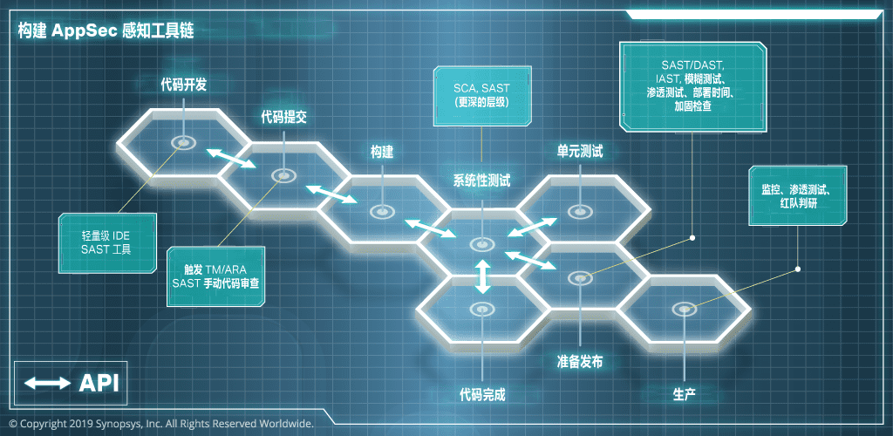

### **DevSecOps（开发-安全-运维）**  

**DevSecOps**（Development + Security + Operations）是**在 DevOps 过程中集成安全性**的一种实践。它的核心理念是：  
> **安全应贯穿于软件开发生命周期（SDLC）的每个阶段，而不是作为事后补救。**  

传统 DevOps 关注 **CI/CD 和运维自动化**，但安全通常是开发完成后才进行测试（容易遗漏漏洞）。DevSecOps 则在开发的**每个阶段**都引入安全机制，使安全性成为**开发人员的责任，而不仅仅是安全团队的任务**。  

---

## **DevSecOps 的核心原则**
✅ **Shift Left（安全左移）**：尽早在开发阶段进行安全测试，减少修复成本。  
✅ **自动化安全检测**：在 CI/CD 中集成 SAST（静态分析）、DAST（动态分析）等工具。  
✅ **持续监控**：在生产环境实时监控安全风险，如日志分析、入侵检测（IDS）。  
✅ **最小权限原则（Least Privilege）**：限制用户和系统的访问权限，降低风险。  
✅ **合规性检查**：符合 GDPR、ISO 27001、SOC 2 等安全标准。  

---

## **DevSecOps 实施步骤**
### **1. 代码阶段**
🔹 **SAST（静态应用安全测试）**：检查代码中的安全漏洞（如 XSS、SQL 注入）。  
🔹 **依赖检查（SCA，Software Composition Analysis）**：扫描第三方库中的已知漏洞（如 `npm audit`）。  
🔹 **代码签名**：确保代码未被篡改。  

### **2. 构建阶段**
🔹 **容器安全扫描**（如 `Trivy`）：确保 Docker 镜像无漏洞。  
🔹 **CI/CD 安全**（如 GitHub Actions、Jenkins）：限制敏感信息暴露，如 API Key。  
🔹 **基础设施即代码（IaC）安全**（如 Terraform 代码扫描）。  

### **3. 测试阶段**
🔹 **DAST（动态应用安全测试）**：模拟黑客攻击，测试 API 和 Web 应用的漏洞（如 OWASP ZAP）。  
🔹 **IAST（交互式应用安全测试）**：结合 SAST 和 DAST，提高检测精度。  
🔹 **Fuzzing 测试**：向应用程序输入随机数据，检测未处理的异常。  

### **4. 部署 & 运行阶段**
🔹 **WAF（Web 应用防火墙）**：拦截恶意请求（如 Cloudflare、AWS WAF）。  
🔹 **RASP（运行时应用自我保护）**：在应用运行时自动阻止攻击（如 Contrast Security）。  
🔹 **日志分析 & SIEM（安全信息和事件管理）**：检测异常行为。  
🔹 **零信任（Zero Trust）**：所有访问请求必须进行身份验证。  

---

## **DevSecOps 工具链**
| **类别** | **工具示例** |
|---------|-----------|
| **SAST（静态分析）** | SonarQube, Checkmarx, Fortify |
| **DAST（动态分析）** | OWASP ZAP, Burp Suite |
| **SCA（依赖安全扫描）** | Snyk, WhiteSource, Dependabot |
| **容器安全** | Trivy, Aqua Security |
| **基础设施安全（IaC）** | Terraform Scanner, Checkov |
| **CI/CD 安全** | GitHub Actions Secrets, HashiCorp Vault |
| **日志 & 监控** | Splunk, ELK, Datadog |

---

## **DevSecOps vs. DevOps**
| **对比项** | **DevOps** | **DevSecOps** |
|-----------|----------|-------------|
| **关注点** | 开发 & 运维自动化 | 在 CI/CD 中集成安全 |
| **安全性** | 事后测试 | 开发时内置安全 |
| **工具** | CI/CD、自动化测试 | SAST、DAST、SCA、安全监控 |
| **目标** | 快速交付 | 安全 + 快速交付 |

---

## **为什么 DevSecOps 重要？**
🚀 **降低安全风险**：在开发阶段发现漏洞，减少生产环境风险。  
💰 **节约成本**：安全左移，减少事后修复的代价。  
⚡ **提升合规性**：符合行业安全标准，如 GDPR、ISO 27001。  
📈 **增强团队协作**：让开发、运维和安全团队共同负责安全。  

